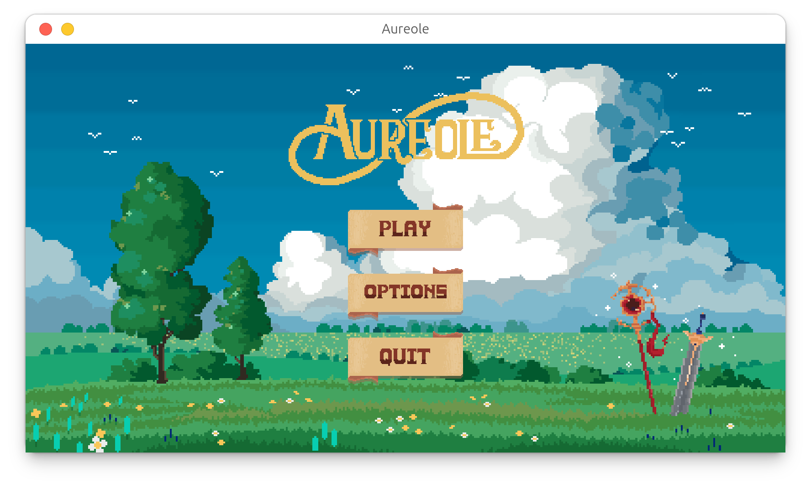
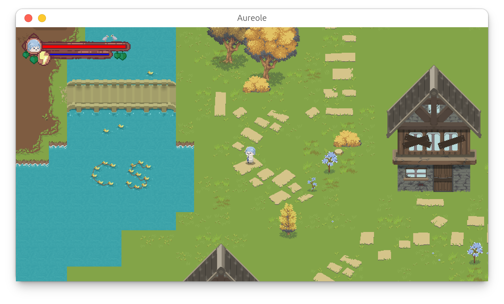

# Aureole 2D Game 🎮

**Aureole** is a 2D side-scrolling action-adventure game built entirely with **Java**. The game focuses on classic platforming mechanics, featuring challenging level designs, enemy encounters, and smooth character animations.

The project demonstrates the application of **Object-Oriented Programming (OOP)** principles to build a scalable game engine from scratch, handling everything from physics simulation to entity management without relying on external game engines.

---

## 📥 Download

You can download the playable version (**Aureole.jar**) directly from the Releases page:

👉 [**Download Latest Version Here**](https://github.com/TWFILM/Aureole-2D-Game/releases)

*(Note: You will need Java installed on your machine to run the .jar file)*

---

## 📸 Screenshots

  
  &nbsp; &nbsp;
  

  <b>Menu Screen</b> &nbsp; | &nbsp; <b>In-Game Action</b>

---

## ⚔️ Game Details & Mechanics
* **Core Gameplay:** Players must navigate through hand-crafted levels, avoiding traps and defeating enemies to reach the final objective.
* **Combat System:** Includes melee attacks and hit-detection mechanics.
* **State Management:** The game utilizes a state machine to handle different game phases (Menu, Playing, Pause, Game Over).
* **Custom Physics:** Implements gravity, collision detection, and velocity-based movement.

---

## 🚀 Key Features
- **Dynamic Character Control:** Responsive movement for walking, jumping, and attacking.
- **Enemy AI:** Simple AI behaviors including patrolling and player tracking.
- **HUD & UI:** Real-time health bars and interactive menus.
- **Asset Management:** Efficient loading and rendering of sprites and audio resources.

---

## 🛠️ Tech Stack
- **Language:** Java (JDK 8+)
- **Library:** Java Swing / AWT

